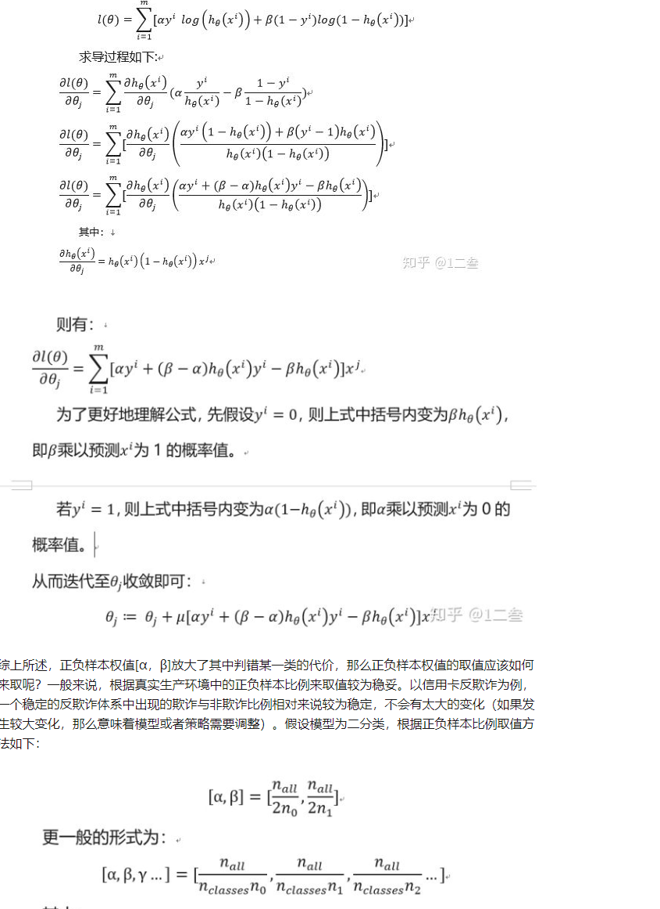
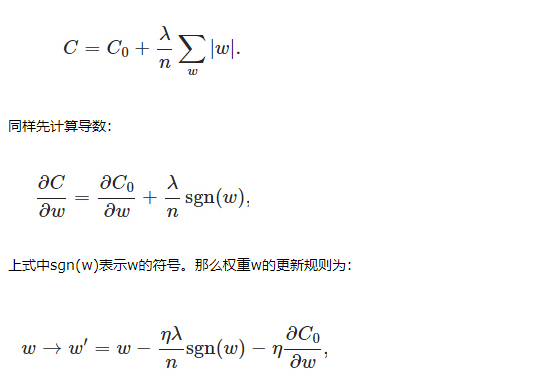
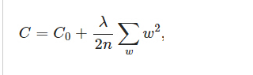
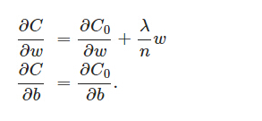
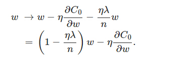

### 非算法部分知识点

##### 1.模型评估方法

###### 1.1 分类模型评估

- **P-R曲线**

  精确率：预测为真实际为真占预测为真的比例

  召回率：预测为真实际为真占实际为真的比例

  P-R曲线横坐标为召回率 纵坐标为精确率

  P-R曲线会受到正负样本比例的影响 

- **ROC曲线**

  横坐标为伪阳率（False positive rate；FPR 预测为真实际为假的数量 除以负样本的总数）

  纵坐标为真阳率（True positive rate；TPR 预测为真实际为真的数量 除以正样本的总数）

  ROC曲线通过截断点来绘制，对于二分类而言，将所有预测结果按照模型输出概率排序，从正无穷开始依次作为截断点

  当截断点为正无穷的时候大于等于截断点预测为真，显然预测为真的个数为0，此时FPR和TPR都为0，当截断点为排序后第一个样本的概率输出时，如果该样本为真，预测为真实际为真的个数为1，预测为真实际为假的样本数为0，总的正样本数为M，负样本数为N，TPR=1/M,FPR=0/N

  以此类推，以最后一个样本的预测值为阈值 预测为真实际为真的个数为M，预测为真实际为假的个数为N ，最后结束点一定在（1,1）

  

  为什么随机分类器AUC值为0.5？

  假设样本正样本占比m%，负样本占比n%

  将样本随机分为10等分 使得对应y值分别为0.1,0.2，......1 

  当阈值为0.1时  FPR=m% * 10% / m%  TPR=n% * 10 % / n%

  阈值为 0.2 时  FPR=m% * 20% / m%  TPR=n% * 20 % / n%

  ......

  

##### 2.样本不平衡问题

###### 2.1 类别不平衡问题评估

使用ROC曲线评估类别不平衡问题

使用P-R曲线进行类别不平衡问题的评估

###### 2 .2 类别不平衡问题处理方法

- 上采样少类别的样本

   上采样少数类别，最简单的就是将少数类别的数据重复使用

   还可以SMOTE，对于少数样本T，SMOTE算法可以合成NT个样本

   （1）从全部T个样本中找到一个样本 xi ,找到xi的k个近邻（可以通过欧氏距离计算），

  （2） 从k个近邻中随机选择一个样本 在生成一个0到1之间的随机数合成新的样本  xnew = xi +β （xnear-xi）

​    (3) 将上述步骤重复n次 生成NT个样本

- 下采样多数样本数据

- 对多数样本进行随机欠采样 然后生成N组样本 分别和少数样本组成N组训练样本 将模型在这N组训练样本上进行训练 并进行模型集成

- 对不同类型的样本乘上一个不同的代价 修改损失函数关于不同样本的权重 例如 [α，β] =[ nall /2 n0,nall /2 n1  ]以LR为例

  

  

##### 3. 优化算法

###### 3.1 损失函数

###### 3.2 经典优化算法

##### 4.正则化 

###### 4.1 L1正则

考虑在原始的损失函数L(w) 上加上正则项 L（w）+C ||w|| 新增加的正则项关于w求导 ，当w小于0的时候 正则项对于w的偏导数为  -C ， 当w大于0时正则项对于w的偏导数为C，如果L(w) 关于W的偏导数绝对值小于C 那么当w为负数时 新的损失函数关于w的偏导数为负 损失函数单调递减 ,当w为正时， 新的损失函数关于w的偏导数为正 损失函数单调递增，因此新损失函数在w为0处取到最小值。

如果想让更多的w取到0 可以增大C的取值 

当w为0的时候，|w| 是不可导的我们只能按照未经未经正则化的方法去更新w即 sgn(0)=0

###### 4.2 L2正则

在不使用L2正则的时候 w系数为1，当使用正则的时候系数衰减为1-ηλ/n

当过拟合的时候 由于需要顾及每一个点 最终形成的拟合函数波动很大 即在某一个小的函数区间内 函数值变化剧烈 这就意味着在某一个小的区间里导数值很大，所以通过约束参数的范数不要太大 可以起到减小过拟合的效果

