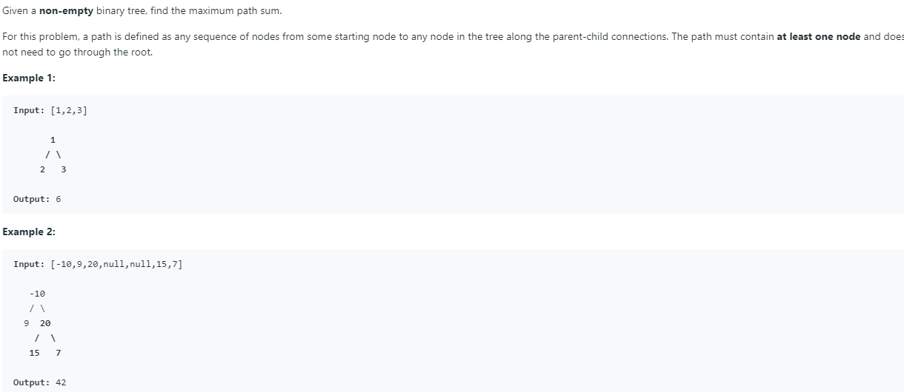

#### 算法必考题

https://www.zhihu.com/question/19805213 刷题list

- 0.刷题时的code技巧
- 1.数组相关
- 2.链表相关
- 3.树相关
- 4.字符串相关
- 5.深度优先遍历和宽度优先遍历相关
- 6.排序相关
- 7.回溯相关
- 8.动态规划相关
- 9.位运算相关
- 10.栈，队列 设计类 
- 11. 经典问题集合 

在此总结算法中常考题目，精简各个算法的必考题型以及关于海量数据常考题型 为秋招做准备

##### 0.刷题时常用的code 技巧

HashMap 进行遍历 例如 HashMap<Character,Integer> map=new HashMap<>()

一般会使用 

```java
 for(Character c: map.keySet()){
     
 }
或者

for(Entry<Character,Integer> entry:map.entrySet()){

}
```

但是这样有一个问题就是遍历的顺序是不定的  为了使得按照放入map的顺序进行遍历 可以使用LinkedHashMap来存储数据

在hashMap数据结构中 经常会遇到判断一个元素是不是在map中的情况 如果存在就取出来 对其value进行更新 如果不存在就赋初值 这时候要用到

map.put(keyValue, map.getOrDefault(keyValue,initValue)+1)


**对于重复循环问题的写法**

这里可以参考 leetcode 1091. Shortest Path in Binary Matrix 

由于每一步都可以向上下左右 以及四个方向 因此可以设置一个类似卷积核的东西 循环遍历这八个方向

private static final int[]d={-1,0,1}

for(int dx:d){

  for (int dy:d){

    int p=x+dx
    
     int q=y+dy

}

}

这样就不用重复的写八次类似的代码  

同时 因为用到了宽度优先遍历 所以肯定会使用一个Queue来存储二维矩阵中特定的点的位置 如果要存储横纵坐标则需要Queue<int[]> 但是如果存储 横坐标 * 每一行的总数 +纵坐标 即展开成一维后的位置 就只用存储一维即可

```java
private static final int[] d = { -1, 0, 1 }; // neighbors' displacements.
    public int shortestPathBinaryMatrix(int[][] grid) {
        Queue<Integer> que = new LinkedList<>();
        if (grid[0][0] == 0) // if starting point not blocked. 
                que.offer(0);
        Set<Integer> seen = new HashSet<>(que); // avoid duplicates.
        int ans = 0, n = grid.length;
        while (!que.isEmpty()) {
            ++ans; // increase one per round of search.
            for (int sz = que.size(); sz > 0; --sz) { // breadth control.
                int x = que.peek() / n, y = que.poll() % n; // decode.
                if (x == n - 1 && y == n - 1) // find shortest path.
                    return ans; // return its length.
                for (int dx : d)  // traverse 8 neighbors of (x, y);
                    for (int dy : d) {
                        int p = x + dx, q = y + dy; // neighbor's coordinates.
                        if (p >= 0 && p < n && q >= 0 && q < n && grid[p][q] == 0 && seen.add(p * n + q))
                            que.offer(p * n + q); // add it into queue if it is valid, and not blocked or visited.
                    }
            }
        }
        return -1;
    }
```


##### 1.字符串转化为数字

该题型主要考察给定一个字符串 将其转化为整数 浮点数 或者给定一个字符串判定该字符串中数字是否符合某一限制的要求 例如判断是否为合法IP，以及

- **将一个整数翻转** （leetcode 7） 

  ```java
  class Solution {
      public int reverse(int x) {
          int rev=0;
          while(x!=0){
              int pop =x%10;
              x=x/10;
              if (rev > Integer.MAX_VALUE/10 || (rev == Integer.MAX_VALUE / 10 && pop > 7)) return 0;
              if (rev < Integer.MIN_VALUE/10 || (rev == Integer.MIN_VALUE / 10 && pop < -8)) return 0;
              rev=rev*10+pop;
          }
          return rev;
      }
  }
  ```

  在java中负数的取余操作也是负数 -12 % 10 = -2  因此对于正负数是一致的

  第二个需要注意的点是 判断越界的时候一定是在临越界的前一次判断 

- **将一个str转化为整数**

  ```java
   public int myAtoi(String str) {
           int index=0;
          int sum=0;
          int signal=1;
          while(index<str.length() && str.charAt(index)== ' '){
              index++;
          } // 处理空格
          if(index<str.length() && (str.charAt(index)=='+' || str.charAt(index)=='-')){
              signal=str.charAt(index)=='+'?1:-1;
              index++;
          } //处理第一位+和-
          for(;index<str.length();index++){
              int tmp=str.charAt(index)-'0';
              if(tmp<0 || tmp>9){
                  break;
              }
              if(sum>Integer.MAX_VALUE/10 || (sum==Integer.MAX_VALUE/10&&tmp>Integer.MAX_VALUE%10)){
                  return signal==1?Integer.MAX_VALUE:Integer.MIN_VALUE;
              }
              sum=sum*10+tmp;
          }
  
             return signal*sum;
      }
  ```


- 将string 转化为double

  ```java
  public double strToDouble(String str){
      int index=0;
      int signal=1;
      int sum=0;
      if(index<str.length()&&(str.charAt(index)=='+')||(str.charAt(index)=='-')){
          signal=str.charAt(index)=='+'?1:-1;
          index++;
      }
      for(;index<str.length();index++){
          if(str.charAt(i)=='.'){
              break;
          }
          int tmp=str.charAt(i)-'0';
          sum=sum*10+tmp;
      }
      double sum2=0;
      if(index<str.length()){
          for(int j=str.length()-1;j>index;j--){
              int tmp=str.charAt(j)-'0';
              sum2=(sum2+tmp)/10;
          }
      }
      return (double)(sum+sum2)*signal;
      }
      
      
  }
  ```

- 判断IP地址是否合法

  ```java
  public boolean isValidate（String str):{
      if(str.length()<7 || str.length()>15){
       return false;
      }
      String[]strs=str.split('.');
      if(strs.length!=4){
          return false;
      }
      for(int i=0;i<strs.length;i++){
          int sum=0
          for(int j=0;j<strs[i].length();j++){
              int tmp=str[i].charAt(j);
              if(j==0 && strs[i].length()>1){
                  if(tmp<'1'||tmp>'9'){
                      return false;
                  }
              }else{
                  if(tmp<'0'||tmp>'9'){
                      return false;
                  }
              }
              sum=sum*10+tmp;
              
          }
          if(i==1){
              if(sum<1||sum>255){
                  return false;
              }
          }else{
              if(sum<0||sum>255){
                  return false;
              }
          }
      }
      return true;
  }
  ```


**2.数组原地移动问题**

在面对数组原地处理的时候 很容易用到的技巧就是从后往前处理 比如 把一个数组中如果出现 0 就将该位置的后一位也赋值为0 同时其他数据向后移动 总体承载的数据量不变

这时候向后移动可以通过从后向前遍历 后一个值赋值为前一个值的取值  同时为了跳过当前的处理的位置 可以在循环内增加一个i++ ，然后再利用循环

```java
class Solution {
    public void duplicateZeros(int[] arr) {
        for(int i=0;i<arr.length;i++){
            if(arr[i]==0){
                backward(arr,i+1);
                if(i+1<arr.length){
                arr[i+1]=0;
                i++;
            }                
            }            
        }
        
    }
    public void backward(int[]arr,int i){
        for(int j=arr.length-1;j>i;j--){
            arr[j]=arr[j-1];
        }
    }
    
}
```


**位运算** 

1.异或去重


2.字符串去重

2.对一个 由 a-z 组成的字符串 进行原地去重 不额外开辟空间 同时 时间复杂度为 O(n)

题解：a-z只有26位 可以使用一个32位的int 每一位代表一个字母 如果该字母

例如  1<< 'a'-'a'  1左移0位还是1   即 第1位保存 a  同理 1<< 1 等于2 int的第2位保存 b

以此类推

```java
public void deleteDumplicated(char[] str){
    if(str.length<2){
        return;
    }
    int index=0;
    int total=0;
    for(int i=0;i<str.length;i++){
        if(total&(1<<(str[i]-'a'))==0){
            str[index++]=str[i];
            total|=(1<<(str[i]-'a'));
        }
    }
}
```

##### 1.数组

###### 1.1 N个数中找出最小的K个

```java
public ArrayList<Integer> GetLeastNumbers_Solution(int [] input, int k) {
        ArrayList<Integer> result=new ArrayList<>();
        if(input.length==0 || k>input.length){
            return result;
        }
        findKthLargest(input,k);
        for(int i=0;i<k;i++){
            result.add(input[i]);
        }
        return result;
    }
    
     public void findKthLargest(int[] nums, int k) {
         int begin=0;
         int end=nums.length-1;
        while(begin<=end){
            int i=begin;
            int j=end;
            int tmp=nums[i];
            while(i<=j){
                while(i<=j && nums[i]<=tmp){
                    i++;
                }
                while(i<=j&&nums[j]>=tmp){
                    j--;
                }
                if(i<=j){
                    int tmp2=nums[i];
                    nums[i]=nums[j];
                    nums[j]=tmp2;
                    i++;
                    j--;
                }else{
                    nums[begin]=nums[j];
                    nums[j]=tmp;
                    if(j==k-1){
                        return ;
                    }else if(j>k-1){
                        end=j-1;
                    }else{
                        begin=j+1;
                    }
                }
            }
        }
    }
```


###### 1.2 寻找第K大的数 (-----**易考**-----)

```java
 public int findKthLargest(int[] nums, int k) {
         int begin=0;
         int end=nums.length-1;
        while(begin<=end){
            int i=begin;
            int j=end;
            int tmp=nums[i];
            while(i<=j){
                while(i<=j && nums[i]>=tmp){
                    i++;
                }
                while(i<=j&&nums[j]<=tmp){
                    j--;
                }
                if(i<=j){
                    int tmp2=nums[i];
                    nums[i]=nums[j];
                    nums[j]=tmp2;
                    i++;
                    j--;
                }else{
                    nums[begin]=nums[j];
                    nums[j]=tmp;
                    if(j==k-1){
                        return nums[j];
                    }else if(j>k-1){
                        end=j-1;
                    }else{
                        begin=j+1;
                    }
                }
            }
        }
        return -1;
    }
```

时间复杂度分析  因为每一次只需要处理其中一个部分的数据 理想情况下每一次选择的tmp数据都能够将数据完美的切分成两个相等的部分 那么 第一次遍历的数据个数为n个 第二次遍历的数据为 n/2 个 第三次遍历数据为 n/4 以此类推 得到一个等比数列 

n+n/2+n/4+n/8+...+1 = n（1+1/2+1/4+...+1/n）约等于 2n-2

所以时间复杂度为O(n)

###### 1.3 将红白蓝三色小球排成一排 使得颜色相同的小球相邻 

荷兰国旗问题 也是三路快排的一个典型的应用场景 使用三个指针 begin，cur，end 三个指针 使用cur指针遍历当cur为红时 将cur和begin交换 同时begin++ cur++，当cur为白时 cur++ ，当cur为蓝时  将cur和end交换 end--，但是此时cur不变 因为此时交换来的元素还需要进行比对

```java
class Solution {
    public void sortColors(int[] nums) {
        int begin=0;
        int end=nums.length-1;
        for(int i=0;i<=end;i++){

            if(nums[i]==0){
                swap(nums,begin++,i);
            }else if(nums[i]==2){
                swap(nums,end--,i--);
            }
        }
       
        
    }
    public void swap(int[] nums,int i,int j){
        int tmp=nums[i];
        nums[i]=nums[j];
        nums[j]=tmp;
    }
}
```


###### 1.4 2 sum , 3 sum 问题 ， 3sum closet（----易考----）

2sum的变形  在一个不重复的数组中 找出和为定值的所有可能

```java
 public int[] twoSum(int[] nums, int target) {
        List<int[]> list=new ArrayList<>();
        HashMap<Integer,Integer> map=new HashMap<>();
        for(int i=0;i<nums.length;i++){
            if(map.containsKey(nums[i])){
                int[]result=new int[2];
                result[0]=i;
                result[1]=map.get(nums[i]);
                list.add(result);
            }else{
                map.put(target-nums[i],i);
            }
        }
        return result;
    }
```

3sum 在一个数组中 输出所有三个数相加等于0的情况

该题和2sum最大的区别就是 在这个数组中可能存在重复的数据  因此如何简洁的规避重复的情况是该题的重点

```java
class Solution {
     public List<List<Integer>> threeSum(int[] nums) {
        List<List<Integer>> result = new ArrayList<>();
        if(nums == null || nums.length<3){
            return result;
        }
        Arrays.sort(nums);
        for(int i=0;i<=nums.length-3;i++){
            if(i>0 && nums[i] == nums[i-1]){
                continue;
            }
            
            int target = -nums[i];
            int left = i+1;
            int right = nums.length-1;

            twoSumHelper(nums, left, right, target, result);
        }
    return result;
    }
    
    public void twoSumHelper(int[] nums,int left,int right,int target,List<List<Integer>> result){
        while(left<right){
            if(target == nums[left]+nums[right]){
                List<Integer> triplets = new ArrayList<>();
                triplets.add(-target);
                triplets.add(nums[left]);
                triplets.add(nums[right]);
                result.add(triplets);
                
                left++;
                right--;

                while(left<right && nums[left] == nums[left-1]){
                    left++;
                }
                while(left<right && nums[right] == nums[right+1]){
                    right--;
                }
            }else if(target > nums[left]+nums[right]){
                left++;
            }else if(target < nums[left]+nums[right]){
                right--;
            }
        }
    }
}
```


3sum closet

```java
public int threeSumClosest(int[] nums, int target) {
        Arrays.sort(nums);
        int different=Integer.MAX_VALUE;
        int result=0;
        for(int i=0;i<nums.length-1;i++){
            int tmp=nums[i];
            int begin=i+1;
            int end=nums.length-1;
            while(begin<end){
                if(Math.abs(tmp+nums[begin]+nums[end]-target)<different){
                    result=tmp+nums[begin]+nums[end];
                    different=Math.abs(tmp+nums[begin]+nums[end]-target);
                }
                if(tmp+nums[begin]+nums[end]-target>0){
                    end--;
                }else if(tmp+nums[begin]+nums[end]-target<0){
                    begin++;
                }else{
                    return result;
                }
            }
        }
        return result;
        
    }
```


###### 1.5 在m乘m的矩阵中 用n乘n的矩阵在上面滑动 ，求n乘n的矩阵中元素和最大为多少

这道题最关键的思想就是化二维为一维，如果是一个m大小的数组在其中寻找连续n个数使得和最大非常容易求解 那么 对于m乘m的矩阵求n乘n实际上就是将n行进行压缩 压缩为一行 然后求这一行上连续最大的n个数的和

```java
public int getMaxNum(int[][]nums,int n){
    int max=Integer.MIN_VALUE;
    int m=nums.length;
    int[]tmp=new int[m];
    for(int i=0;i<m;i++){
        if(i>=n){
            for(int w=0;w<m;w++){
                  int tmp2=0;
                  if(w>=n){
                     tmp2=tmp2+tmp[w]-tmp[w-n];
                       max=Math.max(max,tmp2);
                  }else{
                      tmp2+=tmp[w];
                   }
             }
            for(int j=0;j<m;j++){
                tmp[i]=tmp[i]+nums[i][j]-nums[i-n][j];
            }          
        }else{
          for(int j=0;j<m;j++){
            tmp[i]+=nums[i][j];
          }
         
        }
        
    }

    for(int w=0;w<m;w++){
        int tmp2=0;
        if(w>=n){
            tmp2=tmp2+tmp[w]-tmp[w-n];
            max=Math.max(max,tmp2);
        }else{
            tmp2+=tmp[w];
        }
    }
    return max
}
```

###### 1.6 给定一个二维矩阵 矩阵中元素只包含0和1 ，返回所有元素都是1的最大正方形面积

leetcode 221

```java
class Solution {
    public int maximalSquare(char[][] matrix) {
        int row=matrix.length;
        int col=row>0?matrix[0].length:0;
        int[][] dp=new int[row+1][col+1];
        int max=0;
        for(int i=1;i<=row;i++){
            for(int j=1;j<=col;j++){
                if(matrix[i-1][j-1]=='1'){
                     dp[i][j]=Math.min(Math.min(dp[i-1][j],dp[i][j-1]),dp[i-1][j-1])+1;
                     max=Math.max(max,dp[i][j]);
            
                }
               
        }
    }
        return max*max;
}
}
```

在一个二维矩阵中找到最大的正方形面积 一个点只有当其上边 左边 左上三个位置都为的最小值 加一 才是当前位置最大正方形最大的边长 

######  1.7 直方图中最大矩形面积

直方图中最大矩形首先要求一个矩形的面积　要知道矩形的高度和宽度　当确定了某一个值作为面积的高度的时候　需要确定该高度的起始位置和终止位置　二者的乘积为面积值

使用一个栈来保存height当遍历整个ｈｅｉｇｈｔ数组的时候　如果当前的ｈｅｉｇｈｔ比栈顶元素大　

```java
class Solution {
    public int largestRectangleArea(int[] heights) {
          Stack<Integer> stack=new Stack<>();
        int begin=0;
        int end=heights.length;
        int max=0;
    while(begin<end){
        if(stack.isEmpty()||heights[begin]>=heights[stack.peek()]){
            stack.push(begin);
            begin++;
        }else{
            int index=stack.pop();
            int height=heights[index];
            int left=stack.isEmpty()?-1:stack.peek();
            max=Math.max(max,height*(begin-left-1));
        }
    }
    while(!stack.isEmpty()){
         int index=stack.pop();
            int height=heights[index];
            int left=stack.isEmpty()?-1:stack.peek();
            max=Math.max(max,height*(begin-left-1));
    }
    return max;
    }
}
```


##### 2. 链表相关

###### 2.1翻转单链表 （------易考------）

递归写法的翻转单链表

```java
public ListNode reverseList(ListNode head) {
        if(head==null || head.next==null){
            return head;
        }
        ListNode re=reverseList(head.next);
        head.next.next=head;
        head.next=null;
        return re;
    }
```

两个注意点 1）当前返回值一直未反转后的头结点 re  2)递归的每一步实际都是将当前节点的下一个节点的next指针指向当前节点  同时将当前节点的next指针赋值为空


非递归写法的翻转单链表

```java
public ListNode reverseList(ListNode head) {
      ListNode dummy=new ListNode(0);
      dummy.next=head;
      ListNode pre=dummy;
      ListNode cur=head;
      while(cur!=null && cur.next!=null){
            ListNode tmp=cur.next;
            cur.next=tmp.next;
            tmp.next=pre.next;
            pre.next=tmp;
       }
        return dummy.next;
    }
```

注意关键点 ： 使用两个指针 pre和cur来表示当前节点和之前节点   

指针之间的交换 1）得到cur指针的下一个指针  2）


###### 2.2 翻转m和 n之间的链表元素 (-------易考-------)


###### 2.3 合并k个排序链表

使用最小堆进行排序 在java里面优先队列使用最小堆实现

```java
class Solution {
    public ListNode mergeKLists(ListNode[] lists) {
        PriorityQueue<ListNode>queue=new PriorityQueue<>(new Comparator<ListNode>(){
            public int compare(ListNode node1,ListNode node2){
                return node1.val-node2.val;
            }
        });
        for(int i=0;i<lists.length;i++){
            ListNode tmp=lists[i];
            while(tmp!=null){
                queue.add(tmp);
                tmp=tmp.next;
            }
        }
        ListNode dummy=new ListNode(0);
        ListNode re=dummy;
        while(!queue.isEmpty()){
            dummy.next=queue.poll();
            dummy=dummy.next;
        }
        dummy.next=null;
        return re.next;
        
    }
}
```


也可以使用归并排序对链表进行排序

```java
class Solution {
    public ListNode mergeKLists(ListNode[] lists) {
        return merge(lists,0,lists.length-1);
    }
    public ListNode merge(ListNode[] lists,int begin, int end){
        if(begin>end){
            return null;
        }
        else if(begin==end){
            return lists[begin];
        }else{
            int mid=(end-begin)/2+begin;
            return mergeSort(merge(lists,begin,mid),merge(lists,mid+1,end));
        }
                                                                                                                                                                                                                        
    }
    public ListNode mergeSort(ListNode node1,ListNode node2){
        ListNode dummy=new ListNode(0);
        ListNode re=dummy;
        while(node1!=null && node2!=null){
            if(node1.val<node2.val){
                dummy.next=node1;
                node1=node1.next;
                dummy=dummy.next;
            }else{
                dummy.next=node2;
                node2=node2.next;
                dummy=dummy.next;
            }
        }
        dummy.next=node1==null?node2:node1;
        return re.next;
        
    }
}
```


##### 3.树相关

###### 3.1 判断该树是否为平衡二叉树

```java
public boolean isBalanceＴｒｅｅ(TreeNode root){
    if(root==null){
        return true;
    }
    int left=getDepth(root.left);
    int right=getDepth(root.right);
    if(Math.abs(left-right)>1){
        return false;
    }else{
        return isBalanceTree(root.left)&&isBalanceTree(root.right);
    }
}
public int getDepth(TreeNode root){
    if(root==null){
        return 0;
    }
    return Math.max(getDepth(root.left),getDepth(root.right))+1;
}
```


###### 3.2 判断该树是否为完全二叉树

```java
public isTotalTree(TreeNode root){
    Queue<TreeNode> list=new LinkedList<>();
    list.add(root);
    while(!list.isEmpty()){
        TreeNode tmp=list.polll();
        if(tmp!=null){
            list.add(tmp.left);
            list.add(tmp.right);
        }else{
            while(!list.isEmpty()){
                if(list.poll()==null){
                    return false;
                }
            }
        }
    }
    return true;
}
```


###### 3.3 判断该树是否为二叉查找树

```java
 public class Solution {
        public boolean isValidBST2(TreeNode root) {
            if (root == null) return true;
            return valid(root, Long.MIN_VALUE, Long.MAX_VALUE);
        }
        public boolean valid(TreeNode root, long low, long high) {
            if (root == null) return true;
            if (root.val <= low || root.val >= high) return false;
            return valid(root.left, low, root.val) && valid(root.right, root.val, high);
        }
    }
```


###### 3.3 二叉搜索树的第k大节点 

```java
class Solution{
   
    int index=0;
    public TreeNode getk（ＴｒｅｅＮｏｄｅ　ｒｏｏｔ,int k）{
        if(root!=null){
            TreeNode tmp=getk(root.left,k);
            if(tmp!=null){
                return tmp;
            }
            inde++;
            if(index==k){
                return root;
            }
            TreeNode tmp2=getK(root.right,k);
            if(rmp2!=null){
                return tmp2;
            }
        }
        return null;
}
    
}

```


###### 3.4 判断该树是否对称

```java
public boolean ｓｙｍｅｓｔｒｉｃ(TreeNode root){
    if(root==null || (root.left==null&&root.right==null)){
        return true;
    }
    else if(root.left!=null && root.right!=null){
        if(root.left.val==root.right.val){
            return symestric(root.left)&&symestric(root.right);
        }else{
            return false;
        }
    }else{
        return false;
    }
}
```


###### 3.4 翻转二叉树


###### 3.5 判断该树是否为完全二叉树且为二叉查找树


###### 3.6   二叉树Z字形输出  二叉树右视图输出

右视图输出即输出每一层最右侧的元素 因此只需要在层序输出的时候将每一层的最后一个元素拿出即可

```java
 public List<Integer> rightSideView(TreeNode root) {
        Queue<TreeNode > queue=new LinkedList<>();
        List<Integer> list=new ArrayList<>();
        if(root==null){
            return list;
        }
        queue.add(root);
        while(!queue.isEmpty()){
            int size=queue.size();
            for(int i=0;i<size;i++){
                TreeNode tmp=queue.poll();
                if(i==size-1){
                    list.add(tmp.val);
                }
                if(tmp.left!=null){
                    queue.add(tmp.left);
                }
                if(tmp.right!=null){
                    queue.add(tmp.right);
                }
            }
        }
        return list;
    } 
```

针对Z字型输出  最直观的做法是将数据放入到队列中 然后将层序遍历奇数层不变 偶数层将该层的数据进行reverse ，但是这样需要一个额外的reverse操作 如何规避这个操作呢

使用栈 利用一个flag变量来标识顺序

```java
 public List<List<Integer>> zigzagLevelOrder(TreeNode root) {
         List<List<Integer>> result=new ArrayList<>();
        if(root == null){
            return result;
        }
        Stack<TreeNode> queue = new Stack<>();     
        queue.add(root);
        boolean tag=true;
        while (!queue.isEmpty()){ //两个循环 第一个控制整体 第二个控制每一层
            List<Integer> tmpResult= new ArrayList<>();
            Stack<TreeNode> nextQueue = new Stack<>();
            while (!queue.isEmpty()){
                TreeNode tmpNode=queue.pop();
                tmpResult.add(tmpNode.val);
                if(tag){
                      
                        if(tmpNode.left!=null){
                            nextQueue.add(tmpNode.left);
                        }
                          if(tmpNode.right!=null){
                            nextQueue.add(tmpNode.right);
                        }
                    }else {
                      
                        if(tmpNode.right!=null){
                            nextQueue.add(tmpNode.right);
                        }
                          if(tmpNode.left!=null){
                            nextQueue.add(tmpNode.left);
                        }
                    }
                }
            queue=nextQueue;
            tag=!tag;
            result.add(tmpResult);
            }
            
        
        return result;
    }
```


###### 3.7 二叉树前 中 后 序遍历

###### 3.8 非递归形式的二叉树前 中 后 遍历

###### 3.9 二叉树pathSum 问题

###### 3.10 根据中序 后序 重构二叉树 （二叉树重构问题）

###### 3.11 二叉树最近公共祖先节点

###### 3.12 二叉树转为链表 

###### 3.13 二叉树中节点之间的最远距离

###### 3.14 二叉树最大路径和 （leetcode 124）



关键点 ： 遍历每一个节点 如果该节点左子树最大值和右子树最大值均为正 则当前节点为顶点组成的路径最大值为 root.val+left+right  如果一正一负 则 最大值为,root.val+tmp 如果均为负 则最大值为 root.val

同时递归返回值要注意返回的只能是一条单边 因此只能返回 Math.max(tmp+root.val,root.val)

```java
class Solution {
    int max=Integer.MIN_VALUE;
    public int maxPathSum(TreeNode root) {
       getMaxPathSum(root);
       return max;
    }
    public int getMaxPathSum(TreeNode root){
         if(root==null){
            return 0;
        }
        int left=getMaxPathSum(root.left);
        int right=getMaxPathSum(root.right);
        int tmp=Math.max(left,right);
        int tmpMax=Math.max(Math.max(root.val,root.val+tmp),root.val+left+right);
        max=Math.max(max,tmpMax);
        return Math.max(tmp+root.val,root.val);
    }
}
```


###### 3.15 统计完全二叉树总结点个数

方法一：层序遍历输出总共节点数

```java
  public int countNodes(TreeNode root) {
        if(root==null){
            return 0;
        }
        int total=0;
        Queue<TreeNode> list=new LinkedList<>();
        list.add(root);
        while(!list.isEmpty()){
            int tmpSize=list.size();
            for(int i=0;i<tmpSize;i++){
                TreeNode tmp=list.poll();
                if(tmp.left!=null){
                    list.add(tmp.left);
                }
                if(tmp.right!=null){
                    list.add(tmp.right);
                }
            }
            total+=tmpSize;
        }
        return total;
    }
```

方法二：利用完全二叉树的性质 如果某一个节点的最左边直到叶子节点的深度 和 最右边直到叶子节点的深度相同  那么这个树就是满二叉树  此时总共节点的数量为 2<sup>n</sup> -1 

因此可以对每一个节点计算最左侧节点深度和最右侧节点深度是否相等 如果相等则利用上述公式求解总节点数  如果不相等  则分别递归求左子树和右子树的节点个数

```java
  public int countNodes(TreeNode root) {
        int left=getLeft(root);
        int right=getRight(root);
        if(left==right){
            return (1<<left)-1;
        }else{
            return 1+countNodes(root.left)+countNodes(root.right);
        }
        
    }
    private int getLeft(TreeNode root){
        int height=0;
        while(root!=null){
            root=root.left;
            height++;
        }
        return height;
    }
    private int getRight(TreeNode root){
        int height=0;
        while(root!=null){
            root=root.right;
            height++;
        }
        return height;
    }

```

###### 3.16 N个节点的二叉树总共有多少种不同形态

当有2个节点的时候 固定住root节点 还剩下2-1=1个节点 可以分为左子树1个节点 右子树0个节点 以及左子树0个节点 右子树1个节点

同样的3个节点的时候 固定root节点 可以分为 左子树2个节点 右子树0个节点 左子树1个节点 右子树1个节点 以及左子树0个节点 右子树2个节点 

因此可以使用递归求解。

```java
public int getTotalNum(int n){
    if(n<=1){
        return n;
    }
    int[]nums=new int[n+1];
    nums[0]=1;
    nums[1]=1;
    for(int i=2;i<=n;i++){
        for(int j=0;j<i;j++){
            nums[i]=nums[i]+nums[i-j-1]*nums[j];
        }
    }
    return nums[n];
}
```


##### 4.字符串相关

###### 4.1字符串的最长公共子串

###### 4.2 最长上升子串

```java
public int getNum(int[] nums){
    if(nums.length==0){
        return 0;
    }
    int[]dp=new int[nums.length];
    int max=0;
    dp[0]=1;
    for(int i=1;i<nums.length;i++){
        for(int j=0;j<i;j++){
            if(nums[i]>nums[j]){
                dp[i]=Math.max(dp[i],dp[j]+1);
            }
        }
        max=Math.max(max,dp[i])
    }
    return max;
}
```


##### 5. 深度优先与宽度优先遍历

###### 5.1 数字字典序排列

```java
class Solution {
    List<Integer> list=new ArrayList<>();
    public List<Integer> lexicalOrder(int n) {
        for(int i=1;i<=9;i++){
            if(i>n){
                return list;
            }else{
                DFS(i,n);
            }
        }
        return list;
    }
    public void DFS(int i,int n){
        if(i>n){
            return;
        }
        
        list.add(i);
        for(int j=0;j<=9;j++){
            if(10*i+j>n){
                return;
            }
            DFS(10*i+j,n);
        }
    }
}
```

主要采用深度优先遍历方法 采用递归的形式，可以把整体想象成为一个十叉树，函数的入口为 遍历1到9 ，深度优先搜索 直到不符合条件则返回上一层 然后遍历该层所有情况 

##### 8.动态规划

###### 8.1 两个字符串只删除操作 操作几次可以让两个字符串相等  并求删除的字符是哪些

题解 对于字符串一般有两种考察形式 一种是可以增删替换 也就是字符串的编辑距离 

另一种是字符串只可以删除 对于只可以删除的其实可以转化为最长公共子序列的问题 找到最长公共子序列 然后剩下的就是需要删除的个数 

1.返回需要删除的字符数

```java
 public static int getDeleteNum(String str1,String str2){
        if(str1.length()==0){
            return str2.length();
        }
        if(str2.length()==0){
            return str1.length();
        }
        int[][]dp=new int[str1.length()+1][str2.length()+1];
        for(int i=0;i<=str1.length();i++){
            dp[i][0]=i;
        }
        for(int j=0;j<=str2.length();j++){
            dp[0][j]=j;
        }
        for(int i=1;i<=str1.length();i++){
            for(int j=1;j<=str2.length();j++){
                if(str1.charAt(i-1)==str2.charAt(j-1)){
                    dp[i][j]=dp[i-1][j-1];
                }else{
                    dp[i][j]=Math.min(dp[i-1][j],dp[i][j-1])+1;
                }
            }
        }
        return str1.length()+str2.length()-2*dp[str1.length()][str2.length()];
        }
```


2.返回重复字符串

```java
  public static String getDeleteNum(String str1,String str2){
        if(str1.length()==0){
            return “”;
        }
        if(str2.length()==0){
            return “”;
        }
        int[][]dp=new int[str1.length()+1][str2.length()+1];
        for(int i=0;i<=str1.length();i++){
            dp[i][0]=i;
        }
        for(int j=0;j<=str2.length();j++){
            dp[0][j]=j;
        }
        for(int i=1;i<=str1.length();i++){
            for(int j=1;j<=str2.length();j++){
                if(str1.charAt(i-1)==str2.charAt(j-1)){
                    dp[i][j]=dp[i-1][j-1];
                }else{
                    dp[i][j]=Math.min(dp[i-1][j],dp[i][j-1])+1;
                }
            }
        }

        int len1=str1.length();
        int len2=str2.length();
        StringBuffer buffer=new StringBuffer();
        while (len1>0&&len2>0){
            if(str1.charAt(len1-1)==str2.charAt(len2-1)){
                buffer.append(str1.charAt(len1-1));
                len1--;
                len2--;
            }else{
                if(dp[len1-1][len2]>dp[len1][len2-1]) {
                    len2--;
                }else{
                    len1--;
                }
            }

            }

        return buffer.reverse().toString();
  }
```


##### 10.栈，队列，设计类

###### 10.1 滑动窗口最大值

```java
public class Solution {
    public ArrayList<Integer> maxInWindows(int [] num, int size)
    {
        ArrayList<Integer> result=new ArrayList<>();
        Deque<Integer> deque=new LinkedList<>();
        if(num.length<size || size==0){
            return result;
        }
        for(int i=0;i<size-1;i++){
            inDeque(deque,num[i]);
        }
        for(int i=size-1;i<num.length;i++){
            inDeque(deque,num[i]);
            result.add(deque.peekFirst());
            outDeque(deque,num[i-size+1]);
        }
        return result;
        
    }
    public void inDeque(Deque<Integer> deque,int num){
        while(!deque.isEmpty()&& deque.peekLast()<num){
            deque.pollLast();
        }
        deque.add(num);
    }
    public void outDeque(Deque<Integer> deque,int num){
        if(!deque.isEmpty() && deque.peekFirst()==num){
            deque.pollFirst();
        }
        
    }
}
```


##### 11.经典问题集合

###### 11.1 田忌赛马问题

典型的贪心问题  首先先将两个数组排序   如果第一个数组的最大值大于第二个数组的最大值 则两个最大值进行比赛  否则  如果第一个数组的最小值大于第二个数组的最小值  则两个最小值比赛  否则 第一个数组的最小值和第二个数组的最大值比赛

```java
public int getWinNum(int[] tianji,int[]qiwang){
    Arrays.sort(tianji);
    Arrays.sort(qiwang);
    int beginTianji=0;
    int beginQiwang=0;
    int endTianji=tianji.length-1;
    int endQiwang=qiwang.length-1;
    int count=0;
    while(beginTianji<=endTianji){
        if(tianji[endTianji]>qiwang[endQiwang]){
            endTianji--;
            endQiwang--;
            count++;
        }else if(tianji[beginTianji]>qiwang[beginQiwang]){
            beginTianji++;
            beginQiwang++;
            count++;
        }else{
            beginTianji++;
            endQiwang--;
        }
    }
    return count;
}
```


###### 11.2 将数字转化为26进制 （进制转化问题）

###### 11.3 将数字转化为字典序问题

###### 11.4 盛水问题

​    

```
public int maxArea(int[] height) {
        int begin=0;
        int end=height.length-1;
        int max=0;
        while(begin<end){
            max=Math.max(max,Math.min(height[begin],height[end])*(end-begin));
            if(height[begin]<height[end]){
                begin++;
            }else{
                end--;
            }
        }
        return max;
    }
```

trap rain water  leetcode 42(每个位置都为)

```java
 public int trap(int[] height) {
     if(height.length<=2){
            return 0;
        }
        int i=0;
        int j=height.length-1;
        int shorter=0;
        int max=0;
        while (i<j){
            int cur=height[i]<=height[j]?height[i++]:height[j--];
            if(cur>shorter){
                shorter=cur;
            }else {
                max+=shorter-cur;
            }
        }
        return max;
    }
```


